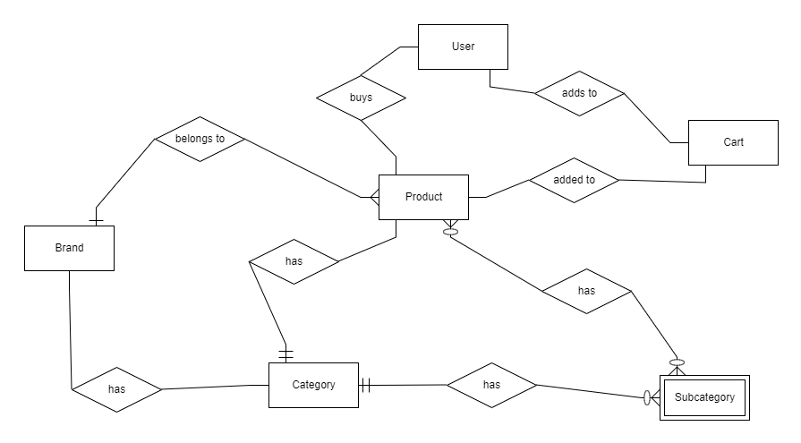

# nutrix
An ecommerce website to sell supplements. 
Project deployed on Heroku can be viewed on [nutrixapp.herokuapp.com](https://nutrixapp.herokuapp.com/).

## Project purpose
The owner would like to sell supplements of some famous brands to consumers.
This project allows users to easily shop for products by brands, category or by all products.
It is built with Python and Django, postgresql as the database, and a bit of HTML, CSS, JavaScript, Boostrap 4 for the frontend. 

## Project Strategy and Scope
### User stories
- User would like to shop by brand. Feature to implement: A page for each brand to show all products.

- User would like to search for products by name . Feature to implement: search bar to be placed on every page so that users can search for product easily

- User would like to be able to view all products and filter by category and subcategories. Feature to implement: A 'all product' page so users can view all products

- User would like to shop by categories. Feature to implement: A page to list products by categories

- User would like to visit webpage that is easy to navigate. Features to implement: Simple UI design where all buttons are visible to allow users a seamless user experience.

- User would like to add product to cart and checkout. Features to implement: Add to cart and checkout 

## Project Structure 
Users will be able to add products to cart whenever they want and also view the products in detail to decide if they want to buy it. 

### ER Diagram

### Project Skeleton
#### Existing Features
- View product by brands
- View product by categories
- Add product to cart 
- Checkout after user comfirms the items in cart

#### Features to implement in the future
- More details in the product details page eg. more pictures, nutritional information, quantity to add to cart
- Pagination of products when list of products increases in size
- Users to be able to review the products and add star ratings for customer confidence
- Users to be able to view their orders and status
- Users to be able to add in address for delivery of product. 

## Project Surface
### Design
- Using strong colors as this is a supplement website, users would be people who workout alot.
- Using light color for background of product cards for more focus on products
- Products can be easily added to cart without going to product details page

## Technologies Used 
- HTML5 used for markup language
- Bootstrap 4, CSS3 used to style webpage
- Jquery used for manipulation of DOM elements
- Heroku used for deployment of webpage to the internet 
- postgresql used for database of project
- Python and Django used for backend and web framework
- Github used for version control
- Gitpod used as online IDE 

## Testing

This website was tested across multiple device screen sizes available in Developer tools(google chrome).
website scales accordingly across different screen sizes. 

I also tested the website manually on

Mobile devices:
Iphone XS max,
Iphone 11 Pro Max, 
Ipad Pro,
Ipad mini,
Samsung A70,
Samsung S20+, 

Computers:
Acer Predator 15inch Google Chrome,
Apple MacBook Pro 13inch Safari, 
Windows Desktop 32inch display Google Chrome, 

manual testing:
- clicking on brand logo returns to home page working
- clicking on 'home' button returns to home page working
- hovering over products will show dropdown with selections of 'All Products', 'Protein', 'Performance', 'Essentials' on large screens working  
- clicking 'products' will show dropdown with selections of 'All Products', 'Protein', 'Performance', 'Essentials' on mobile screens working
- tested sign up, sign in, sign out, sending comfirmation email and comfirming of email, all working 
- tested 'Cart' button goes to view cart working
- tested search bar and autocomplete of product names working and returns search results after clicking on 'search button'
- clicking 'add to cart' adds products to cart and update cart badge quantity
- tested all anchor tags are working, without any broken links except dummy links in the footer
- tested checkout with stripes successful without any errors

## Deployment 
This app is deployed on Heroku

These are the steps i took to deploy the website:

1. In Bash(main project directory), type in 

        pip3 install gunicorn
        pip3 install psycopg2
        pip3 install Pillow
        pip3 install whitenoise 
        pip3 install dj_database_url
        
1. Add Whitenoise to your middleware inside settings.py:

        MIDDLEWARE = [
                .....
                'whitenoise.middleware.WhiteNoiseMiddleware'
        ]

1. Check if you have a .gitignore file.
1. Log into Heroku using the following command:

        heroku login -i
        
1. Make sure that you have logged into Heroku in your terminal. Inside the terminal type in replace <APP NAME> with your app name(has to be unique):

        heroku create <APP NAME>
        
1. Heroku will add two origins to your git remotes. Do a check by running the following You should see 2 more origins with heroku in the url:

        git remote -v
        
1. Open your .env file in Gitpod. 
1. Open a new browser tab, and go to http://www.heroku.com 
1. Click on your app in the dashboard.
1. Click on Settings
1. Click on Reval Config Vars
1. Copy the exported variables in .env over to the Config Vars and omit the quotes.

1. The Procfile contains a command that Heroku will run when the app starts. In the root folder, create a file named Procfile by running this command:

        touch Procfile
        
1. Open the Procfile, and enter the following and replace <PROJECT_FOLDER> with the name of your project folder.

        web: gunicorn <PROJECT_FOLDER>.wsgi:application
        
1. Add the domain name (without the HTTPS) of the the heroku app into the ALLOWED_HOST inside settings.py replace <YOUR_DOMAIN_NAME> with your actual domain name:

        ALLOWED_HOSTS = ["<YOUR_DOMAIN_NAME>", "*"]
        
1. We need a requirements.txt file in our Git repository so that Heroku will know what packages install. run this command:

        pip3 freeze --local > requirements.txt
        
1. In your settings.py file, add in this line. We need this for Whitenoise to work (so that it can serve static files properly):

        STATIC_ROOT = os.path.join(BASE_DIR, 'staticfiles')

1. To deploy Heroku, first, commit your code to your git repo:

        git add .
        git commit -m "your commit message"
        git push heroku master
        
1. We now will set up our Postgres database. We cannot use our normal sqlite3 database anymore.
1. run the command: 

        heroku config
        
1. Copy the value of DATABASE_URL.
1. In your .env file add in this line. replace <DATABASE_URL> with the DATABASE_URL you copied earlier on:

        export DATABASE_URL="<DATABASE_URL>"
       
1. import dj_database_url after the other import statements in settings.py
        
        import dj_database_url
        
1. Comment out your existing DATABASES setting in your settings.py, and paste it after the commented out lines:

        # DATABASES = {
        #     'default': {
        #         'ENGINE': 'django.db.backends.sqlite3',
        #         'NAME': os.path.join(BASE_DIR, 'db.sqlite3'),
        #     }
        # }

        DATABASES = {'default': dj_database_url.parse(os.environ["DATABASE_URL"])}
        
1. Migrate your database:
        
        python3 manage.py migrate
        
1. Commit and push to heroku:
        
        git add .
        git commit -m "Updated settings.py"
        git push heroku master
        
1. Since we have switched to a new database, it won't have any old data, so we have to create the super user once more.

        python3 manage.py createsuperuser
        
1. Attempt to access admin on the Herkou app and add in models

1. Set up stripes to work with new domain by loggin into admin, go to Sites and edit the domain there to match your heroku domain
1. Add in a web hook with your heroku app domain name for checkout.session.completed event. Make sure to set the signing key correctly.

Your website is now deployed! check for website url in the output after push to heroku succeeded. 

## Credits and Acknowledgements

- MusclePharm product images taken from [BSN official site](https://www.gobsn.com/en-us)
- BSN product images taken from [MusclePharm official site](https://musclepharm.com/)
- Optimum Nutrition product images taken from [Optimum Nutrition official site](https://www.optimumnutrition.com/en-us)
- jumbotron MusclePharm banner taken from [MusclePharm official site](https://musclepharm.com/)
- ON logo taken from [here](https://www.adnnutrition.com.ar/producto/creatine-powder-300-grs-optimum-nutrition-unflavored/)
- MusclePharm logo taken from [here](https://hipwallpaper.com/musclepharm-wallpapers/)
- BSN logo taken from [here](https://swolespartan.com/bsn-banner/)
- Bootstrap dropdown on hover code taken from [here](https://www.tutorialrepublic.com/faq/how-to-open-bootstrap-dropdown-menu-on-hover-rather-than-click.php#:~:text=Answer%3A%20Use%20the%20jQuery%20hover,using%20the%20CSS%20and%20jQuery.)
- All other images taken from [pexels.com](https://www.pexels.com)

